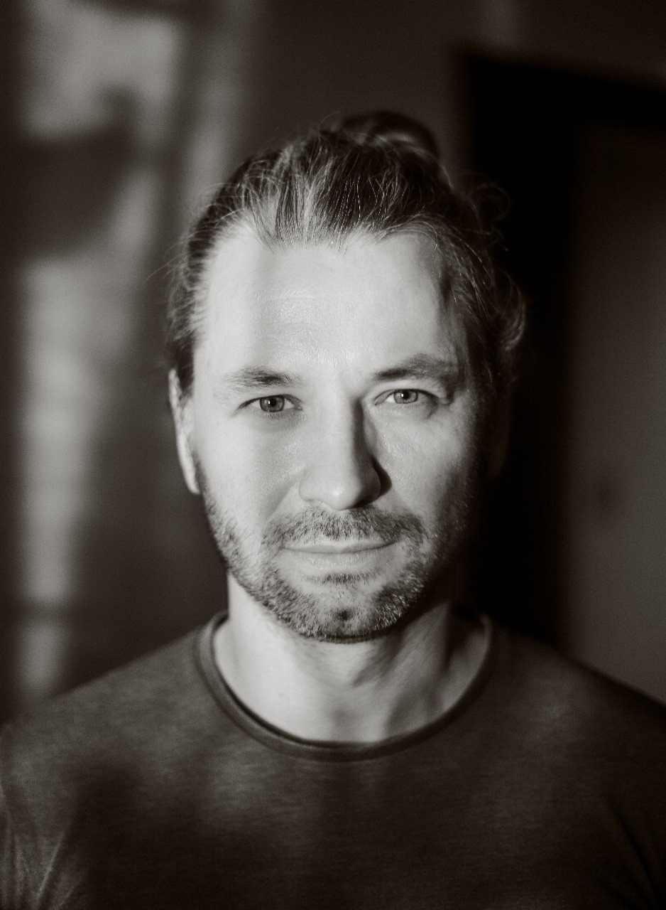

  

# Дмитрий Болдырев

**Высшее образование:**  
• Guglielmo Marconi University (Италия) — Психологическая наука и методы  
• Московский институт психоанализа — Клиническая психология  
• Российский государственный гуманитарный университет — Европейская философия (учусь в н.в.)  

**Дополнительное образование:**  

**Когнитивно-поведенческая терапия:**  
• Основы когнитивно-поведенческой терапии в АКБТ, ДВФУ  
• Возможности когнитивно-поведенческой терапии при работе с клиентом — семинар EACBT  
• Семинары базового и продвинутого курса АКПП:  
— Основы КПТ  
— Когнитивная терапия Аарона Бека  
— Терапевтические отношения  
— Терапия пустого усилия  
— Тренинг коммуникации в парах  
— Психосоматические расстройства  
• Семинар Роберта Лихи «Терапия эмоциональных схем, погружение в смысл терапии»  

**Гуманистические направления психотерапии:**  
• Международная программа по процессуальной психологии Арнольда Минделла  
• Базовая программа обучения гештальт-терапии (МИГИП, потом МИГАС — программа МГИ)  
• Супервизорская программа GATLA (не окончено)  
• Теория и практика дазайн-анализа (РГГУ)  
• Работа со сновидениями в дазайн-аналитической психотерапии (РГГУ)  
• Семинар Алана Ричардсона «Работа с сущностным уровнем»  
• Семинар Арнольда и Эми Минделл «Послание сновидящего тела»  
• Интенсивы московского института гештальта и психодрамы (МИГИП), московского гештальт института (МГИ) и московского института процессуально-интегративной терапии (МИПИТ)  

**Психоаналитическая терапия:**  
• Семинары по введению в психоанализ, Institute of Psychoanalysis (Великобритания)  
• Курс «Введение в психоанализ и психоаналитические теории развития» ИППиП  
• Курс по селф-психологии Кохута, William Alanson White Institute (США)  
• Программа «Психодинамическая психотерапия» в ИППиП (не окончено)  

**Телесная терапия и работа с ПТСР:**  
• Программа по работе с шоковыми травмами и травмами развития с элементами:  
— Работы с травмой по методу Питера Левина  
— Бодинамики Л. Марчер  
— Биоэнергитического анализа А. Лоуэна  
— Биосинтеза Д. Боаделлы  
• Телесно-ориентированная психотерапия. Стратегия и тактика работы (РГГУ)  

**Не работаю:**  
• С детьми и подростками  
• С семейными парами  
• С психиатрией  

**Сколько стоит:**  
6000 рублей за сессию 50 минут  

**[Telegram]([https://t.me/dboldyrev) / [WhatsApp](https://wa.me/79161678330): +7 (916) 167 8330**

